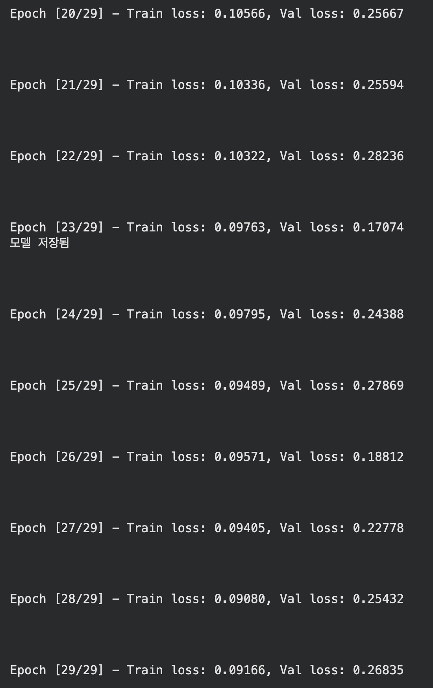
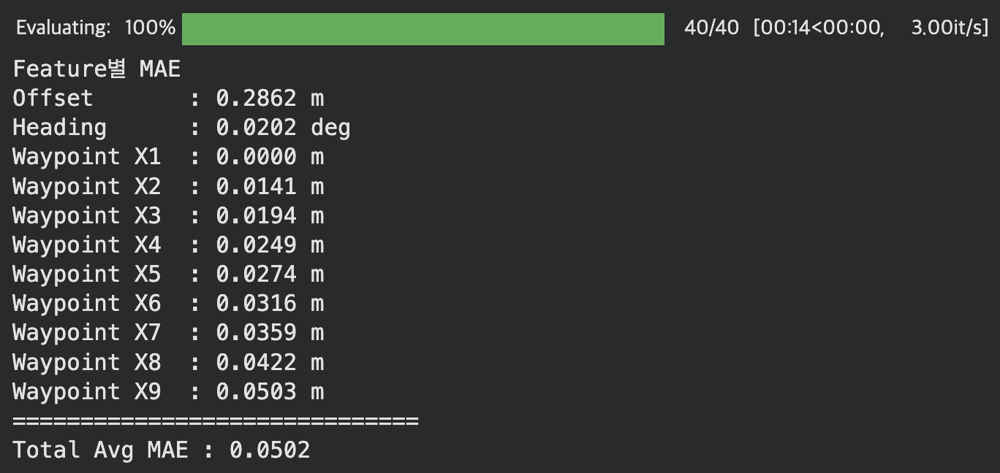

# Webots 기반 차선 유지 제어 시뮬레이션 프로젝트

---
<br>


## 1. 프로젝트 개요 (Project Overview)
본 프로젝트는 **Webots 시뮬레이터 환경**에서 차량의 비전 센서만을 사용하여 안정적인 차선 유지 제어를 구현하는 것을 목표로 합니다.

카메라로 획득한 전방 도로 영상을 CNN기반 모델로 분석하여 차선을 실시간으로 인식하며, 차량 동역학 제어 알고리즘과 ROS2 통신 아키텍처를 결합하여 Webots 시뮬레이션 내에서 안정적으로 주행할 수 있는 시스템을 구축합니다.

* **개발 기간:** 2026.03 ~ 진행 중 (2026.06 완료예정)

---

<br>
<br>

## 2. 팀원 소개 및 역할 (Team Members)
| 이름 | 소속 | 역할 및 담당 기능 |
| :---: | :---: | :--- |
| **김민호** | 숭실대학교 AI소프트웨어학부 | 팀장, 차량 동역학 기반 제어 알고리즘 구현 |
| **박경수** | 숭실대학교 AI소프트웨어학부 | 데이터셋 수집 및 기본 전처리 |
| **김철현** | 숭실대학교 AI소프트웨어학부 | CNN 기반 차선 인식 모델 학습 및 검증 |
| **송규혁** | 숭실대학교 AI소프트웨어학부 | 최종 코드 통합 및 ROS2 연결 |

---

<br>
<br>

## 3. 기술 스택 (Tech Stack)

### Environment & Simulation
 

### Programming Languages
 

### Libraries & Frameworks
   

---

<br>
<br>

## 4. 폴더 구조 (Repository Structure)
```text
├── .gitignore              
├── README.md               
│
├── dataset/               
│   └── README.md           
│
└── src/                    # 프로젝트 소스 코드 폴더
    ├── core/               # 공통 자율주행 베이스라인 및 메인 알고리즘 코드
    ├── Minho/              # 팀원별 개별 작업 및 실험 폴더
    ├── Kyeongsu/               
    ├── Cheolhyun/          
    └── Gyuhyeok/
```

---
<br>
<br>


## 5. 주요 구현 기능 및 세부 내용 (Details)

### 김철현: CNN 기반 차선 인식 모델 학습 및 검증
전방 카메라로부터 입력받은 실시간 도로 이미지에서 동역학 알고리즘에 넣어야 할 특성 3가지를 예측하는 CNN모델 구현

#### 1. **데이터 파이프라인 및 전처리**
   * **Input :** webot상의 도로 이미지
   * **Output :** `Offset`(차선 내의 중앙점과 차량 중심점의 횡방향 거리), `heading각도`(차선방향과 차량진행방향 사이의 각도), `차선 중앙값 좌표 9개`(차량 기준 전방 1m간격의 $X$좌표 9개)
   * **데이터 정규화 (Z-score) :** 각 피처 별 예측해야 하는 물리값의 단위 범위 차이로 인해 특정 피처에만 편향되어 학습되는 문제를 방지하기 위해, 데이터 정규화를 수행하여 학습 안정성을 확보
   * **ImageNet 톤매너 매칭 :** 전이학습 모델의 사전 성능을 극대화하기 위해 입력 이미지를 3채널 RGB로 변환 후 ImageNet의 평균(`[0.485, 0.456, 0.406]`) 및 표준편차(`[0.229, 0.224, 0.225]`)에 맞춰 정규화 파이프라인을 구축

#### 2. 모델 아키텍처
* ResNet50 기반 전이학습
* **독립적 멀티헤드 설계 :** 추출된 특징 맵을 기반으로 `Offset` 헤드, `Heading` 헤드, `Waypoints` 헤드로 독립 분기되는 Sequential을 구성하여 각 피처의 예측 성능을 향상

#### 3. 모델 학습 전략
* **2단계 학습 기법 :**
  * **Phase 1 (Epoch 0~4):** 사전 학습된 Backbone의 가중치를 고정한 채, 새로 추가한 헤드들만 높은 학습률로 빠르게 초기 학습
  * **Phase 2 (Epoch 5~30):** 전 레이어의 잠금을 해제하여 Fine-Tuning을 진행했으며, 이때 Backbone은 1e-5, 헤드는 1e-4 수준의 보수적인 정밀 학습률을 차등 적용하여 Catastrophic Forgetting을 방지
* **AMP 도입 :** 정밀도가 중요한 연산을 `float32`, 속도가 중요한 연산은 `float16`으로 변환하여 연산해주는 AMP를 도입하여 GPU 메모리 소모량을 최소화하고 추론 속도를 단축
* **학습률 스케줄러 :** Fine-Tuning 단계부터 `ReduceLROnPlateau`를 적용해 Validation Loss 정체 시 학습률을 1/2 배씩 감소시킴

#### 4. 배포 최적화 및 최종 검증
* **물리값 변환 Wrapper 및 TorchScript 컴파일 :**
    * 정규화된 출력값이 아닌 실제 물리값을 즉시 뱉어낼 수 있도록 `DeploymentModel` Wrapper를 설계하였음
    * 최적의 Validation 상태에서 `torch.jit.trace` 기법을 사용하여 `best_resnet_model.pt`를 최종 저장함
* **모델 검증 결과 :** 테스트 데이터셋에 대해 각 피처별로 MAE값을 개별 측정

| Feature | MAE | 물리적 의미 |
| :--- | :---: | :--- |
| **Offset** | `0.2862 m` | 차량 중심선 이탈 오차 |
| **Heading** | `0.0202 deg` | 차선과 차량 사이의 각도 오차 |
| **Waypoint X1** | `0.0000 m` | 전방 1m 지점 $X$ 좌표 오차 |
| **Waypoint X2** | `0.0141 m` | 전방 2m 지점 $X$ 좌표 오차 |
| **Waypoint X3** | `0.0194 m` | 전방 3m 지점 $X$ 좌표 오차 |
| **Waypoint X4** | `0.0249 m` | 전방 4m 지점 $X$ 좌표 오차 |
| **Waypoint X5** | `0.0274 m` | 전방 5m 지점 $X$ 좌표 오차 |
| **Waypoint X6** | `0.0316 m` | 전방 6m 지점 $X$ 좌표 오차 |
| **Waypoint X7** | `0.0359 m` | 전방 7m 지점 $X$ 좌표 오차 |
| **Waypoint X8** | `0.0422 m` | 전방 8m 지점 $X$ 좌표 오차 |
| **Waypoint X9** | `0.0503 m` | 전방 9m 지점 $X$ 좌표 오차 |
| **Total Avg MAE** | **`0.0502`** | **전체 피처 최종 평균 오차** |

* **최종 학습 로그 캡처 (Epoch 20 ~ 29)**
  

* **최종 오차 평가 캡처**
  
